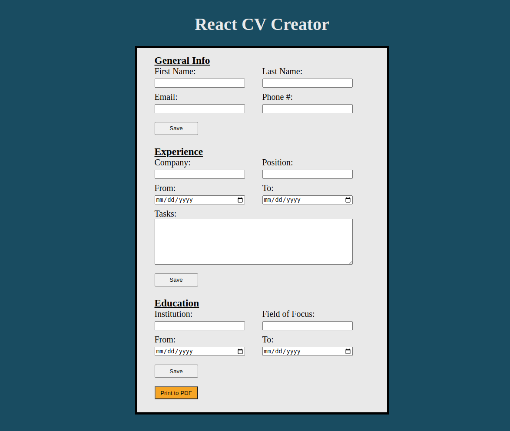

# CV-Creator

Project from [The Odin Project](https://www.theodinproject.com/)

## [Live Demo](https://gustav72.github.io/CV-Creator/)

### Technologies Used

React

CSS3

Git

### Overview

This application allows users to create a CV and then print it out! This project was created using React. Every section has its own component. Future improvements include a more visually appealing UI, ability to add custom sections, and the ability to remove any section not wanted.

Thank You for taking the time to look at my work!
